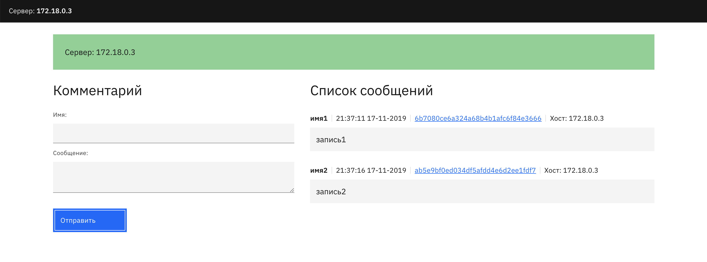

# GuestBook



Демонстрационноное приложение с бекендом на питоне (DB + RestAPI) и фронтенд на ангуляре, которые мы используем в обучающих целях на воркшопах.  
Обычно в практиках оно собирается и распространяется через докер-образа.

Цель: настроить запуск приложения через ansible не используя докер для деплоя.

Приложение состоит из следующих сервисов:  nginx - отдача статики и проксирование определенных эндпоинтов на бекенд, MySQL - база данных, миграции данных проходят автоматически в момент запуска приложения, python-приложение, которое является бекендом.

- Не использовать galaxy-роли для nginx и других сервисов
- Для запуска приложения создать systemd-unit
- Запуск, настройку MySQL, добавление базы/пользователей можно через докер образ и/или galaxy роль.
- ОС - ubuntu или centos
- Конфигурация приложения осуществляется чреез ENV-переменные, см. config.py
- Фронт находится в каталоге front

Пример конфигурации nginx
```conf
...
	root /front;

	index index.html;

  location = /notes {
    proxy_pass http://127.0.0.1:5000;
  }
  location ^~ /comment/ {
    proxy_pass http://127.0.0.1:5000;
  }
  location ^~ /note {
    proxy_pass http://127.0.0.1:5000;
  }
```

Запуск приложения
```bash
/usr/bin/python3 /guestbook
```

Установка зависимостей из Докерфайла
```Dockerfile
RUN apt-get update && apt-get install python3-pip python3-setuptools libev-dev locales -y
RUN pip3 install flask bjoern sqlalchemy sqlalchemy_utils pymysql pytest cryptography
RUN locale-gen en_US.UTF-8
ENV LANG en_US.UTF-8
ENV LANGUAGE en_US:en
ENV LC_ALL en_US.UTF-8

RUN apt install -y nginx
```
